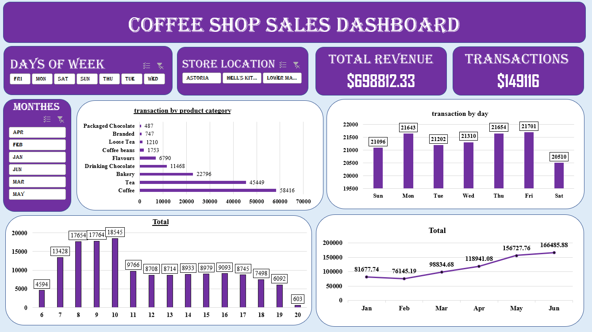

# Coffee Shop Sales Dashboard | Excel, PivotTables & Interactive Analytics
## Project Objective
Analyze coffee shop sales data using Excel by preparing and cleaning the dataset, exploring trends with PivotTables, and building an interactive dashboard to uncover insights on revenue, transactions, product performance, and store locations.

## Dashboard Preview

##Questions (KPIs)

-  How many transactions were recorded? 
-  What is the total revenue generated? 
-  How does revenue vary by month? 
-  Which day of the week has the most transactions?
-  Which hour of the day has the highest transaction volume? 
-  Which product category generates the most transactions? 
-  What are the Top 15 product types by transactions? 
-  Which product types generate the highest revenue? 
-  How does store location affect sales performance? 
-  What operational improvements can increase revenue or efficiency?
  
##Proces
-Data Cleaning & Preparation 
-	Feature Engineering (Revenue, Month, Day, Hour) 
-	PivotTable Analysis 
-	Sales Trend Exploration 
-	Product Performance Evaluation 
-	Interactive Dashboard Development 
-	Insight Generation & Recommendations

