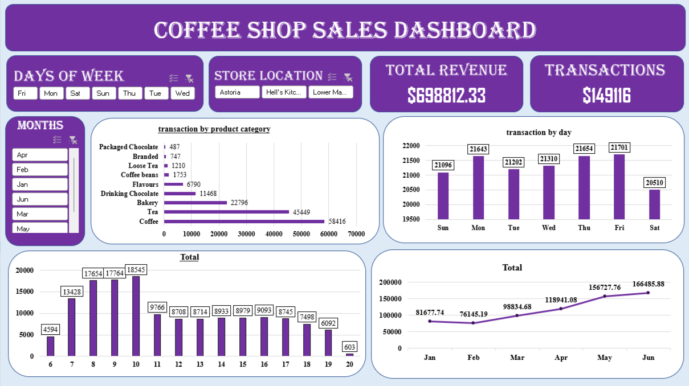

# Coffee Shop Sales Dashboard | Excel, PivotTables & Interactive Analytics
## Project Objective
Analyze coffee shop sales data using Excel by preparing and cleaning the dataset, exploring trends with PivotTables, and building an interactive dashboard to uncover insights on revenue, transactions, product performance, and store locations.

## Excel File

📥 [Download Coffee_Shop_Sales_Dashboard.xlsx](./Coffee_Shop_Sales_Dashboard.xlsx)

## Dashboard Preview

## Questions (KPIs)

- How many transactions were recorded?
- What was the total revenue generated?
- How did revenue vary by month?
- Which day of the week recorded the highest number of transactions?
- Which hour of the day had the highest transaction volume?
- Which product category generated the most transactions?
- What were the Top 15 product types by transactions?
- Which product types generated the highest revenue?
- How did store location affect sales performance?
- What operational improvements could increase revenue and efficiency?

## Process

- Data Cleaning & Preparation
- Feature Engineering (Revenue, Month, Day of Week, and Hour)
- PivotTable Analysis
- Sales Trend Exploration
- Product Performance Evaluation
- Interactive Dashboard Development
- Insight Generation & Recommendations

## Key Insights

- Coffee was the best-selling product category with **58,416 transactions**, followed by Tea with **45,449 transactions**.
- Friday recorded the highest number of transactions with **21,701 sales**, while Saturday had the lowest with **20,510 sales**.
- Total revenue reached **$698,812.33** from **149,116 transactions** during the analyzed period.
- Revenue showed a steady upward trend, increasing from **$81,677.74 in January** to **$166,485.88 in June**.
- Peak sales activity occurred at **10 AM**, with **18,545 transactions**, followed by **9 AM (17,764)** and **8 AM (17,654)**.
